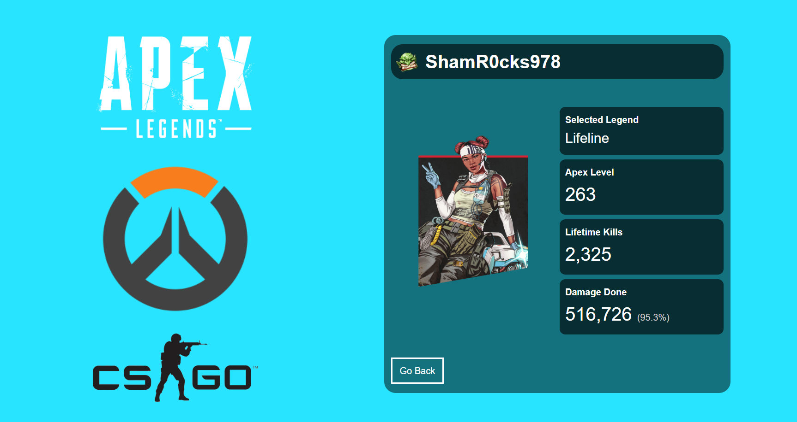

# Stat_Tracker
<p>
  
  <a href="https://github.com/Ebyrd10/burgers_taskmaster#readme" target="_blank">
    
  </a>
  <a href="https://github.com/Ebyrd10/burgers_taskmaster/graphs/commit-activity" target="_blank">
    
  </a>
</p>

A full-stack app to track a user's accomplishments and statistics in Apex Legends and Overwatch.



## Technology
	
* HTML
* JavaScript
* CSS
* Third Party APIs
* Axios
* Custom Server-Side API
* Vue
* Express
* Node.js
* Concurrently
* Morgan
* Nodemon


## Install

```sh
npm install
```

## Usage

```sh
npm run dev
```

## Author

👤 **Ethan Byrd**

* Website: www.ethanmbyrd.com
* Github: [@Ebyrd10](https://github.com/Ebyrd10)
* LinkedIn: [@Ethan-byrd](https://linkedin.com/in/Ethan-byrd)

## 🤝 Contributing

Contributions, issues and feature requests are welcome!<br />Feel free to check [issues page](https://github.com/Ebyrd10/burgers_taskmaster/issues). You can also take a look at the [contributing guide](https://github.com/Ebyrd10/burgers_taskmaster/blob/master/CONTRIBUTING.md).

## Show your support

Give a ⭐️ if this project helped you!
## Support

Reach out to me at one of the following places!

- Website at <a href="http://www.Ethanmbyrd.com" target="_blank">`Ethanmbyrd.com`</a>
- LinkdenIn at <a href="https://www.linkedin.com/in/ethan-byrd/" target="_blank">`https://www.linkedin.com/in/ethan-byrd/`</a>

---

## License

[](http://badges.mit-license.org)

- **[MIT license](http://opensource.org/licenses/mit-license.php)**
